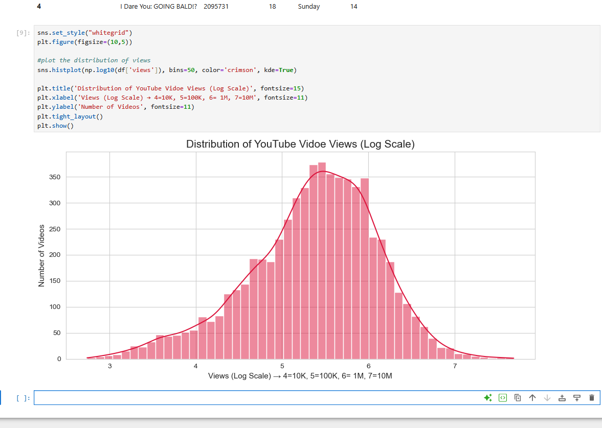
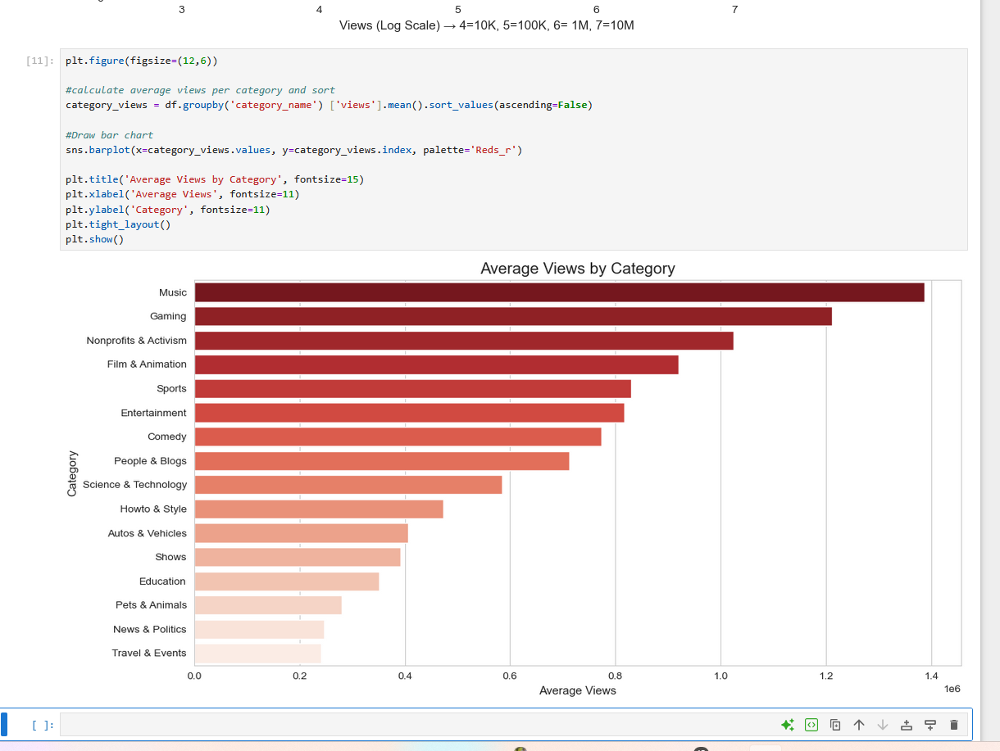
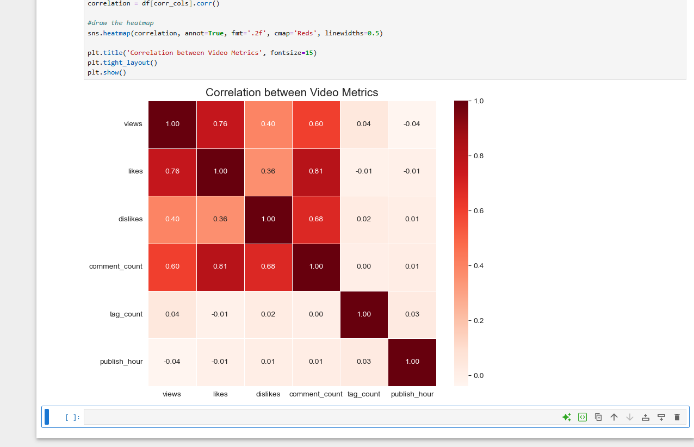
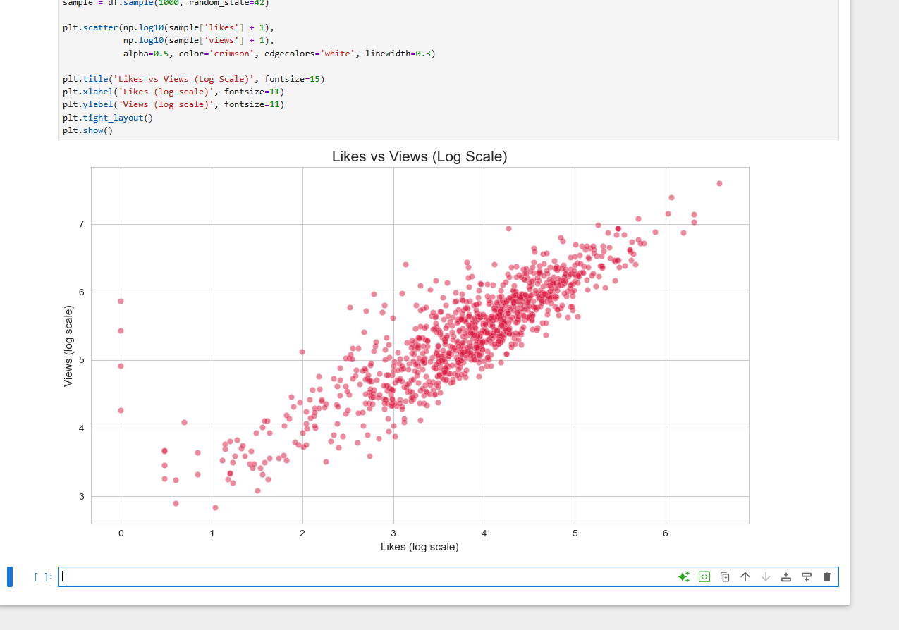
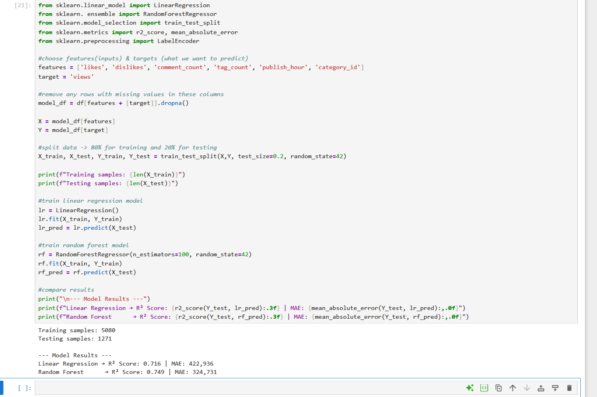
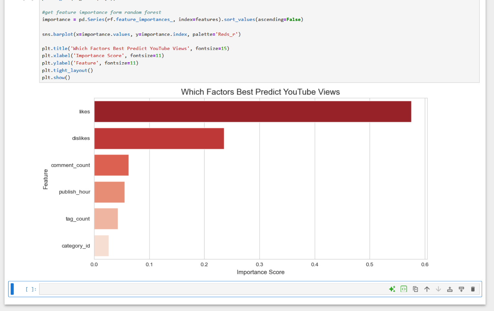
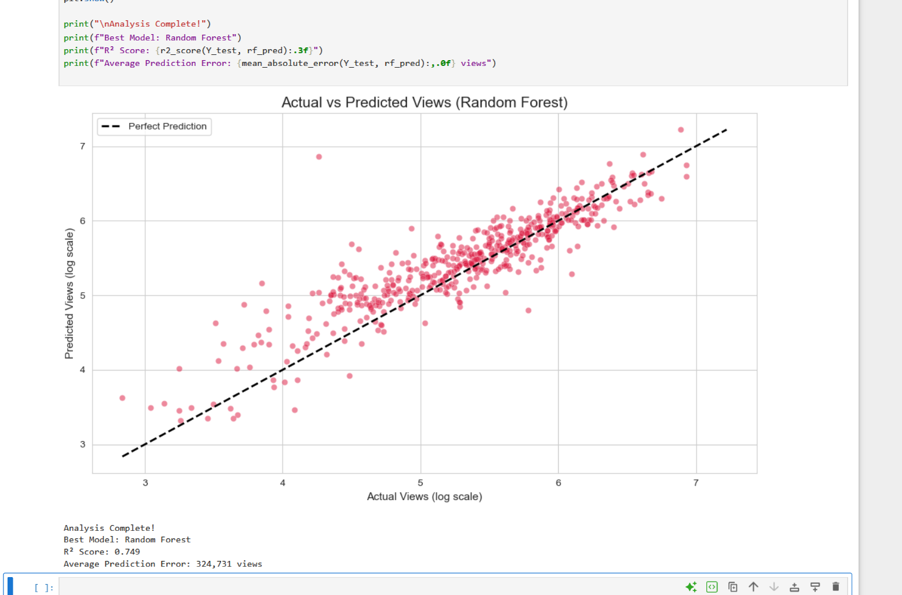

# youtube-view-prediction
Data Science Assignment 3 - YouTube View Count Prediction

# YouTube View Count Prediction
**Data Science Module — Assignment 3 | March 2026**

## Research Question
> Can we predict the view count of a trending YouTube video based on its engagement metrics and metadata?

# Dataset
- **Source:** [YouTube Trending Videos — Kaggle](https://www.kaggle.com/datasets/datasnaek/youtube-new)
- **File Used:** USvideos.csv (US Trending Videos, 2017–2018)
- **Original Rows:** 40,949 entries
- **After Cleaning:** 6,351 unique videos
- **Features:** views, likes, dislikes, comment_count, category, publish_time, tags

## Tools & Libraries
| Tool | Purpose |
|---|---|
| Python | Programming language |
| Pandas | Data loading and cleaning |
| NumPy | Numerical calculations |
| Matplotlib & Seaborn | Data visualization |
| Scikit-learn | Machine learning models |

## Exploratory Data Analysis

### 1. View Distribution
Most trending YouTube videos receive between 100K and 10M views, peaking around 1 million.

### 2. Average Views by Category
Music (~1.4M) and Gaming (~1.2M) are the highest viewed categories. Travel & Events has the lowest.

### 3. Correlation Heatmap
Likes (0.76) and comment_count (0.60) are the strongest predictors of views. Tag count and publish hour show near-zero correlation.

### 4. Likes vs Views Scatter Plot
Clear diagonal trend confirms the strong positive relationship between likes and views.

## Machine Learning Models

Two regression models were trained using an **80/20 train-test split.**

### Model Results
| Model | R² Score | Mean Absolute Error |
|---|---|---|
| Linear Regression | 0.716 | 422,936 views |
| **Random Forest**  | **0.749** | **324,731 views** |

> Random Forest was selected as the final model with **74.9% accuracy.**

### 5. Feature Importance
Likes alone account for ~58% of the model's predictive power — the strongest single signal.

### 6. Actual vs Predicted Views
Dots cluster tightly around the perfect prediction line, confirming strong model reliability.

## Key Findings
- **Likes** is the strongest predictor of views (~58% feature importance)
- **Music & Gaming** are the top trending categories by average views
- **Tag count** has almost no effect on views — contradicting a common creator belief
- **Upload timing** has minimal impact — content quality matters far more
- Random Forest achieved **R² = 0.749** with an average error of ~325K views

